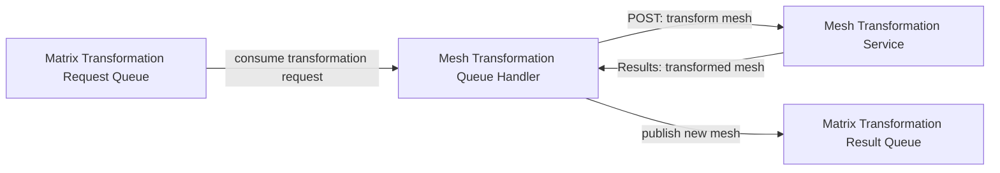

# Matrix Mesh

```mermaid
flowchart LR
    A[Matrix Transformation Request Queue]
    B[Matrix Transformation Result Queue]
    C[Mesh Transformation Queue Handler]
    D[Mesh Transformation Service]

    A-->|consume transformation request|C
    C-->|POST: transform mesh|D
    D-->|Results: transformed mesh|C
    C-->|publish new mesh|B
```